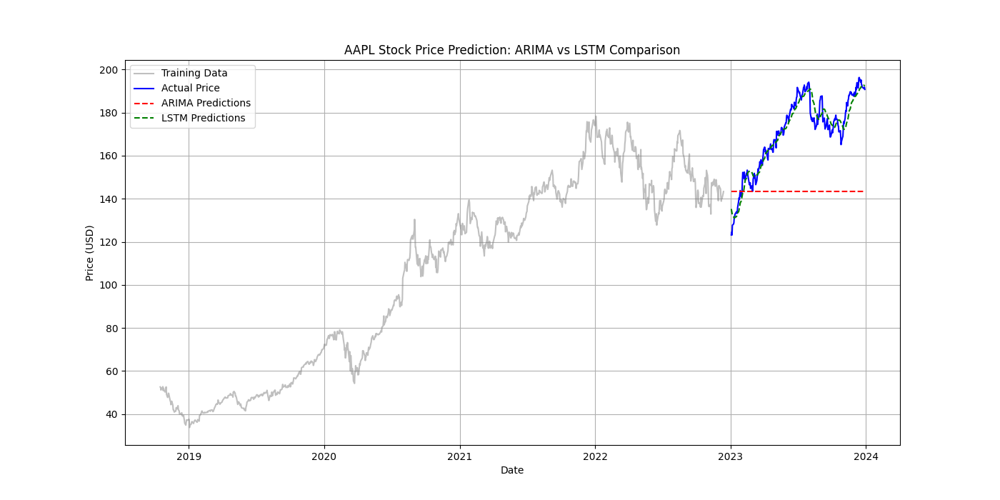

# Stock Price Forecasting System: LSTM vs. ARIMA 📈


## 📌 Project Overview
This project implements a comprehensive stock price forecasting system comparing two distinct modeling approaches:
1.  **LSTM (Long Short-Term Memory):** A Deep Learning Recurrent Neural Network capable of capturing long-term dependencies in sequential data.
2.  **ARIMA (AutoRegressive Integrated Moving Average):** A classical statistical method for time series forecasting.

The system is built using a modular, object-oriented architecture suitable for deployment. It automates the end-to-end workflow: fetching financial data from the Yahoo Finance API, performing technical analysis (feature engineering), training models, and generating rigorous performance evaluations.

## 📊 Key Results
The Deep Learning approach (LSTM) demonstrated superior performance in capturing complex market volatility compared to the statistical baseline.

| Metric | LSTM (Deep Learning) | ARIMA (Statistical) | Verdict |
| :--- | :--- | :--- | :--- |
| **MAPE** | **2.19%** (Excellent) | High | **LSTM Wins** |
| **R² Score** | **0.9286** | ~0.0 | **LSTM Wins** |
| **RMSE** | **$4.62** | High | **LSTM Wins** |
| **MAE** | **$3.69** | High | **LSTM Wins** |

> **Note:** A MAPE score < 5% is generally considered "Excellent" forecasting accuracy in financial domains.

### Visual Comparison
The chart below highlights the model's ability to track the actual stock price trend (Blue) vs the LSTM prediction (Green).


*(Generated output from the system showing Actual vs. Predicted values)*

## 📂 Project Structure
The codebase is organized into a scalable directory structure:

```text
stock_price_forecasting/
├── data/               # Automated data ingestion & storage
├── models/             # Serialized models (LSTM .h5, ARIMA .pkl)
├── notebooks/          # Jupyter notebooks for EDA and rapid prototyping
├── reports/            # Generated performance metrics, plots, and logs
├── src/                # Modular source code
│   ├── config.py       # Centralized configuration (tickers, hyperparameters)
│   ├── data_loader.py  # ETL pipeline for Yahoo Finance data
│   ├── features.py     # Feature engineering (RSI, MACD, Bollinger Bands)
│   ├── lstm_model.py   # Deep Learning architecture & training logic
│   ├── arima_model.py  # Statistical modeling & stationarity tests
│   └── evaluation.py   # Metric calculations (RMSE, MAPE, R2)
├── main.py             # Entry point for the full execution pipeline
└── requirements.txt    # Dependency management
```

## 🚀 Quick Start
1. Installation

Clone the repository and install the required dependencies:
```text
git clone [https://github.com/YOUR_USERNAME/stock-price-forecasting.git](https://github.com/YOUR_USERNAME/stock-price-forecasting.git)
cd stock-price-forecasting
pip install -r requirements.txt
```

2. Running the Pipeline

Execute the main script to download fresh data, train models, and generate the report:
```text
python main.py
```

3. Exploring the Data

To view the Exploratory Data Analysis (EDA) or step-by-step logic, run the notebooks:
```text
jupyter notebook notebooks/01_eda_and_features.ipynb
```

## 🧠 Technical Implementation Details
**Deep Learning (LSTM)**
- Architecture: A sequential model consisting of two LSTM layers (50 units each) to capture temporal dependencies. Added Dropout (0.2) layers after each LSTM block to prevent overfitting.

- Preprocessing: Data is normalized to the range [0, 1] using MinMaxScaler. Time-series sequences are generated with a sliding window of 60 days (lookback) to predict the next day's closing price.

- Training Strategy: utilized the Adam optimizer with a learning rate of 0.001. Implemented Early Stopping (patience=5) to halt training automatically when validation loss stops improving.

**Statistical (ARIMA)**
- Stationarity Check: Implemented the Augmented Dickey-Fuller (ADF) test to check if the time series is stationary. If the p-value is > 0.05, differencing is applied automatically.

- Parameter Tuning: Utilized auto_arima from the pmdarima library to perform a grid search for the optimal (p, d, q) parameters by minimizing the AIC (Akaike Information Criterion) score.

## 📈 Future Improvements
- Sentiment Analysis: Incorporate financial news sentiment (e.g., from FinBERT) as an exogenous variable to better predict price shocks.

- Hyperparameter Tuning: Implement Keras Tuner to optimize LSTM units, dropout rates, and batch sizes dynamically.

- Deployment: Serve the model via a REST API using FastAPI or Flask for real-time predictions.